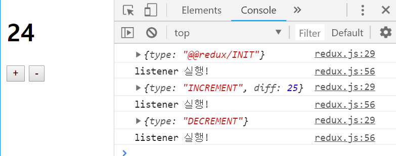
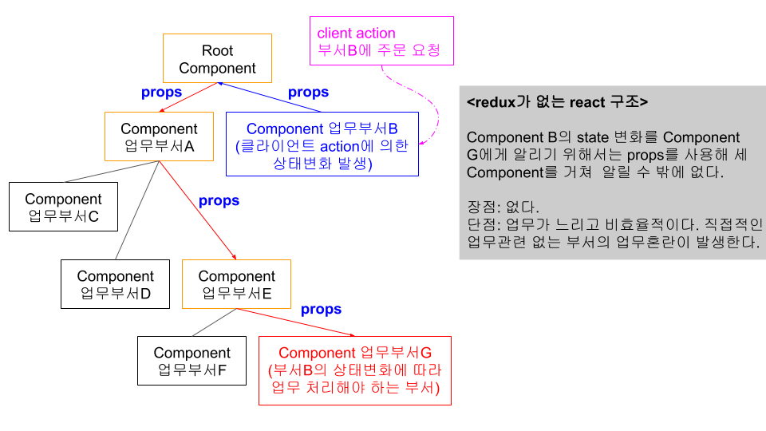
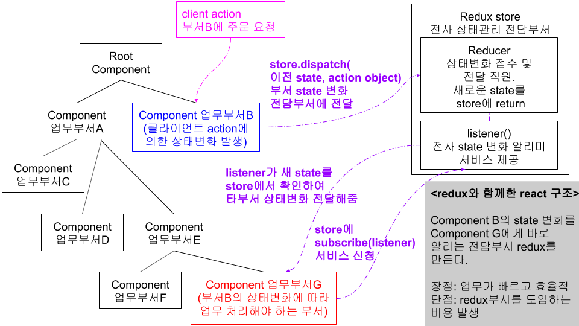

# Redux without React
- Simple plus minus button action
- Redux applied without React, means use Vanilla Javascript.
- Redux is not only for React but Javascript, generally.

  

## Work flow comparison(React without and with Redux)
- React without Redux

  

- React with Redux

  

